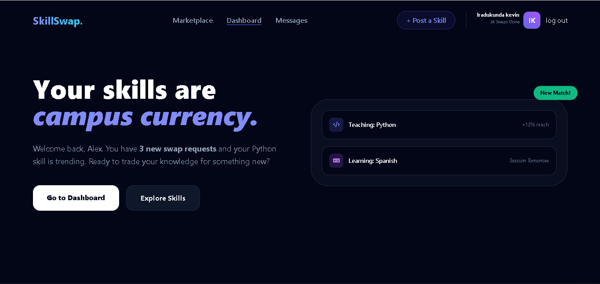

# 🔄 SkillSwap | The Campus Barter Marketplace

**"Stop paying for tutors. Start trading your skills."**

SkillSwap is a unique, problem-solving web platform designed for students to exchange expertise without the need for money. In a community where students are often "cash-poor but skill-rich," SkillSwap turns knowledge into a currency.

---

## 📸 Preview

*Figure 1: The dynamic landing page featuring the "Logged In" state.*

---

## 🚀 The Problem & Solution

- **The Problem:** Private tutoring and skill-building courses are expensive. Most students have valuable talents (coding, languages, design) but no marketplace to trade them for other skills they need.
- **The Solution:** A specialized barter economy platform that matches students based on mutual needs. If you teach me Python, I’ll teach you Spanish.

## ✨ Key Features

* **Skill Matching Algorithm:** Connects users based on "Gives" and "Wants."
* **Reputation System:** Trust-based trading with student-to-student reviews.
* **Dynamic Dashboard:** Track your "Hours Saved" and active trade sessions.
* **Zero-Cost Economy:** A platform built specifically to remove financial barriers from learning.
* **Figma-Ready Design:** Clean, modern "Dark Mode" UI built for high-speed prototyping.

## 🛠️ Built With

* **HTML5** - Semantic structure.
* **Tailwind CSS** - Modern, responsive styling.
* **FontAwesome** - Professional iconography.
* **Figma** - UI/UX Architecture.

## 📂 Project Structure (The 5-Page Logic)

1.  **Landing Page:** The high-conversion pitch and "Explore" entry point.
2.  **Auth Page:** Secure Login/Signup portal for verified student emails.
3.  **Marketplace:** The discovery hub for browsing available skills.
4.  **User Dashboard:** Personal command center for managing trades and stats.
5.  **Post Swap:** A streamlined form for listing new expertise.

---

## ydiasniyonshuti@yahoo.fr
**IRADUKUNDA Kevin** *  25RP00541*
**RP TUMBA COLLEGE**

*"Solving the student budget crisis, one skill at a time."*
